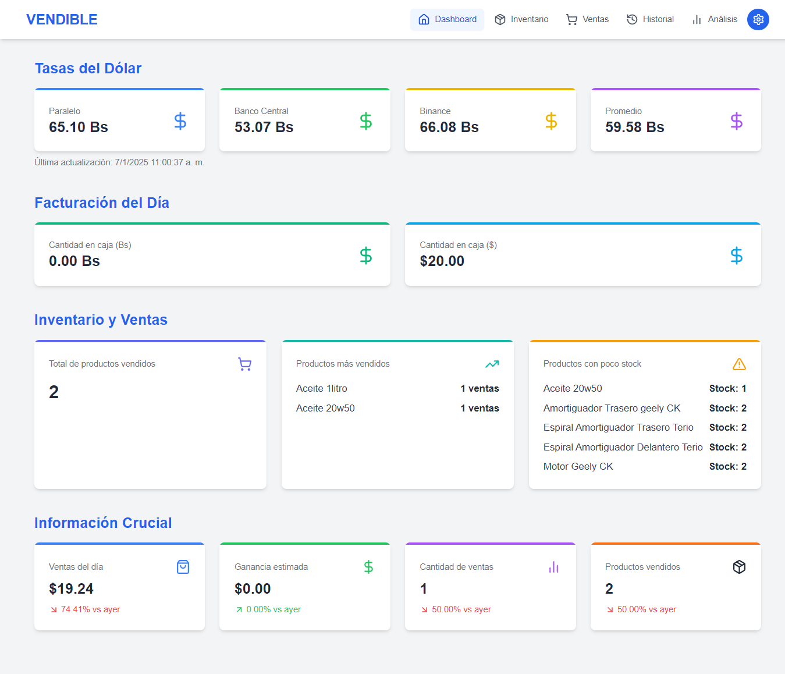
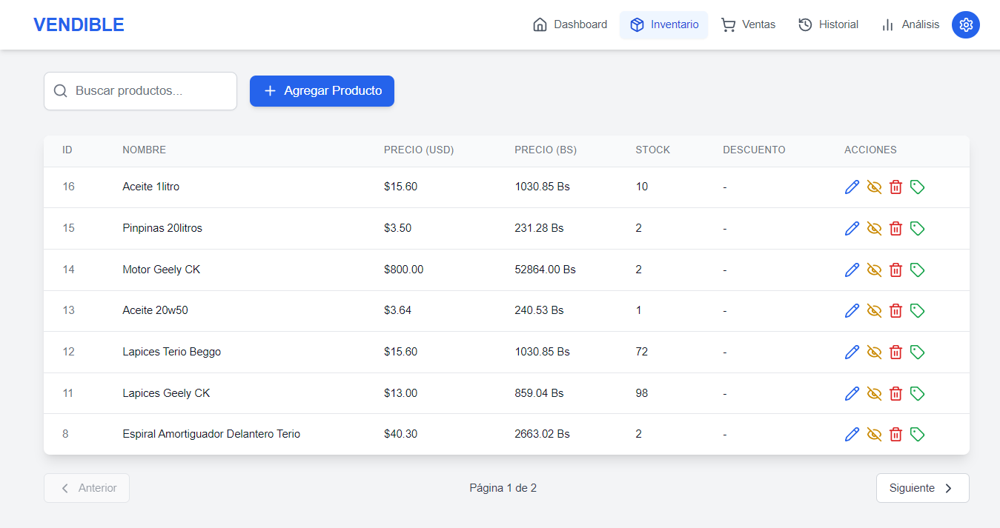
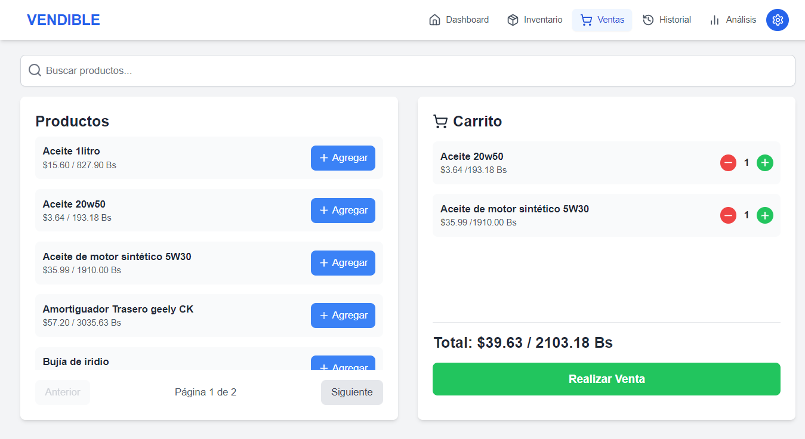
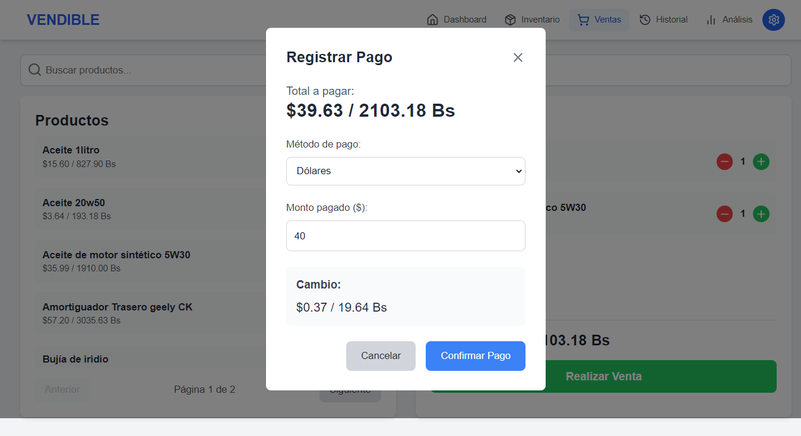
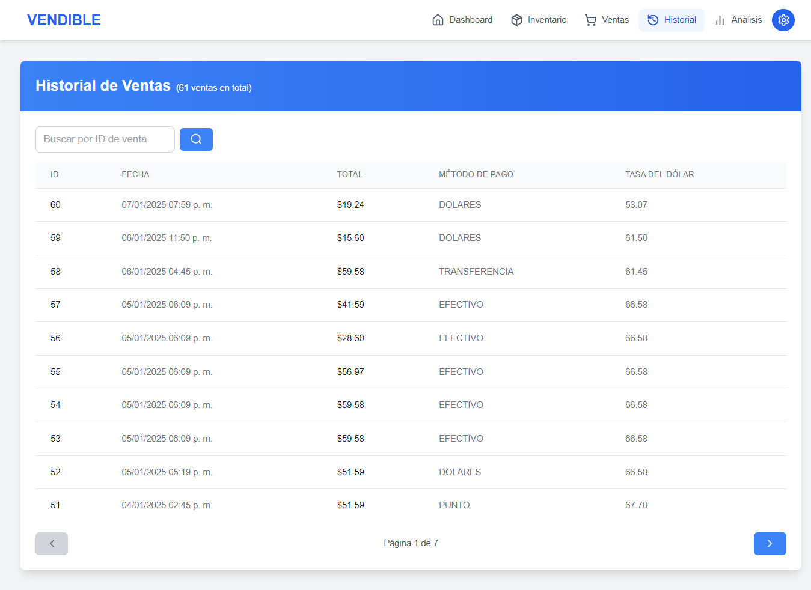
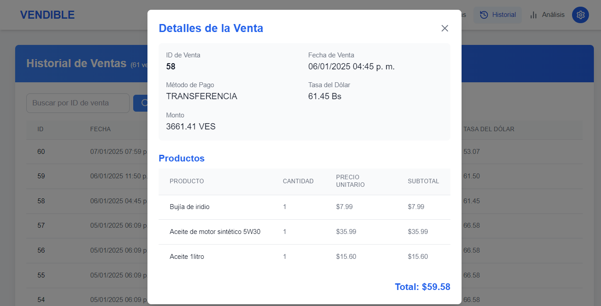
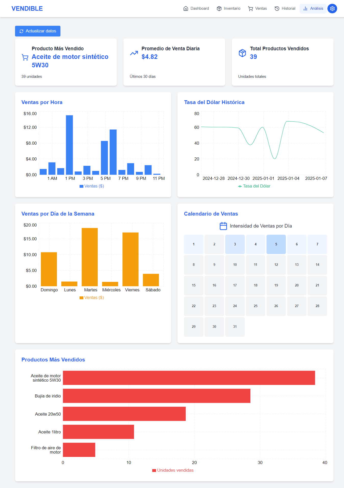
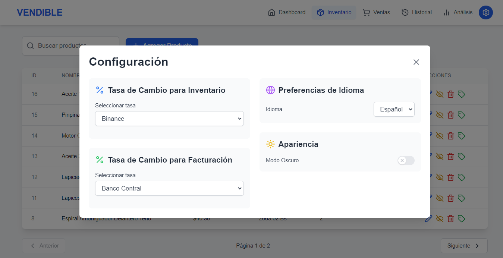
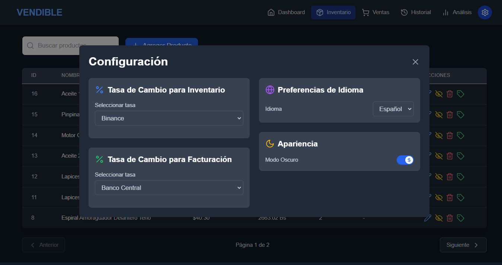

# VENDIBLE

  
  
  
  
  Sistema de facturación e inventario desarrollado por DASCA

## 📋 Descripción

VENDIBLE es una aplicación de escritorio robusta para la gestión de inventario y facturación, diseñada específicamente para negocios que operan con múltiples monedas. Ofrece una interfaz intuitiva y funcionalidades completas para el control de ventas e inventario.

## 🖥️ Interfaz de Usuario

### Dashboard

Vista general con métricas importantes, tasas de cambio actualizadas y resumen de ventas.

### Inventario

Gestión completa de productos con sistema de búsqueda y filtrado avanzado.

### Ventas

Sistema de ventas intuitivo con carrito de compras y múltiples métodos de pago.

### Modal de Venta

Interfaz de registro de pagos con soporte para múltiples monedas.

### Historial

Registro detallado de todas las transacciones realizadas.

### Detalles de Venta

Vista detallada de cada transacción con información completa.

### Análisis

Gráficos y estadísticas detalladas de ventas y rendimiento.

### Configuración

Panel de configuración con opciones de personalización.

### Modo Oscuro

Interfaz adaptable con modo oscuro para mayor comodidad visual.

## ✨ Características Principales

### 💼 Gestión de Inventario

- Control completo de productos con precios en múltiples monedas
- Sistema de búsqueda y filtrado avanzado
- Gestión de stock con alertas de bajo inventario
- Categorización de productos

### 💰 Sistema de Ventas

- Facturación rápida y eficiente
- Múltiples métodos de pago
- Cálculo automático de cambio
- Carrito de compras intuitivo

### 📊 Dashboard y Análisis

- Visualización de métricas clave
- Gráficos de ventas por período
- Análisis de productos más vendidos
- Calendario de intensidad de ventas

### 📜 Historial y Reportes

- Registro detallado de transacciones
- Historial de ventas completo
- Reportes personalizables
- Seguimiento de métodos de pago

## 🛠️ Tecnologías Utilizadas

- **Electron** - Framework para aplicaciones de escritorio
- **React** - Biblioteca de interfaz de usuario
- **TypeScript** - Superset de JavaScript tipado
- **SQLite** - Base de datos local
- **Tailwind CSS** - Framework de estilos
- **Recharts** - Biblioteca de gráficos
- **Electron Builder** - Empaquetado y distribución

## 📦 Scripts Disponibles

- `npm run dev` - Inicia la aplicación en modo desarrollo
- `npm run build` - Compila la aplicación
- `npm run build:win` - Compila para Windows (32/64 bits)
- `npm run build:mac` - Compila para macOS
- `npm run build:linux` - Compila para Linux

## 🔧 Configuración

La aplicación permite configurar:

- Fuentes de tasas de cambio (Binance, Banco Central)
- Idioma de la interfaz
- Tema visual (claro/oscuro)
- Preferencias de visualización
- Métodos de pago personalizables

## 🤝 Contribución

Las contribuciones son bienvenidas. Por favor, lee las guías de contribución antes de enviar un pull request.

## 👥 Autores

- **Carlos Mafifa** - Desarrollo Principal - [GitHub](https://github.com/Mafifa)

## 📞 Soporte

Para soporte y consultas, por favor crear un issue en el repositorio o contactar a través de [mafifa.github.io](https://mafifa.github.io).

---
