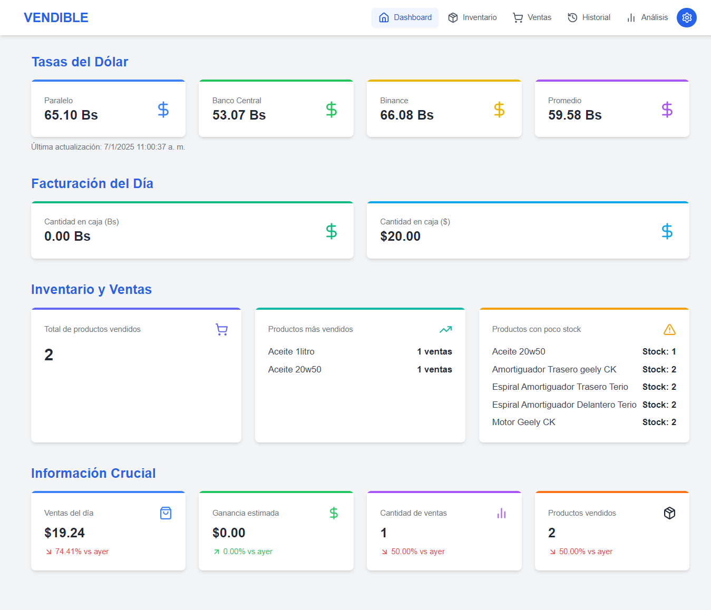
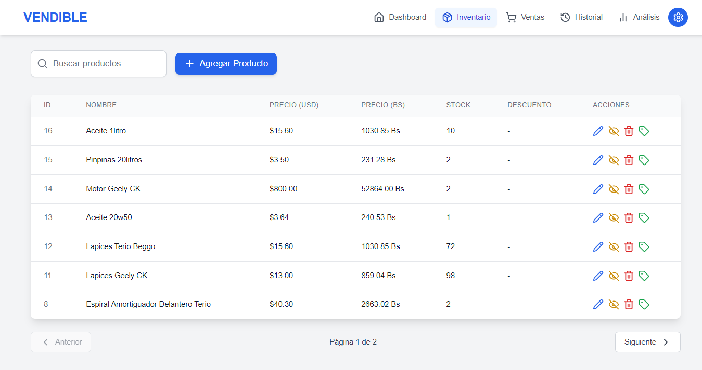
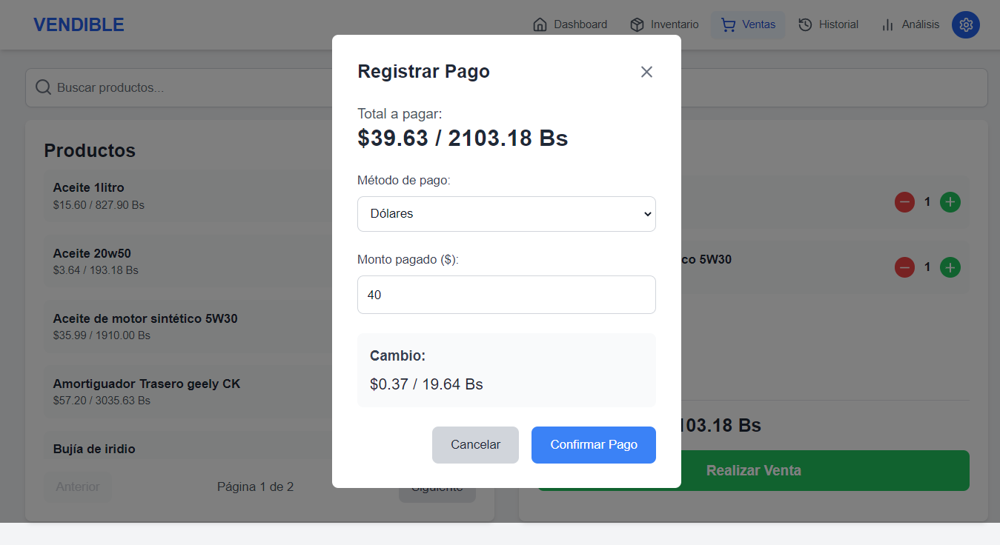
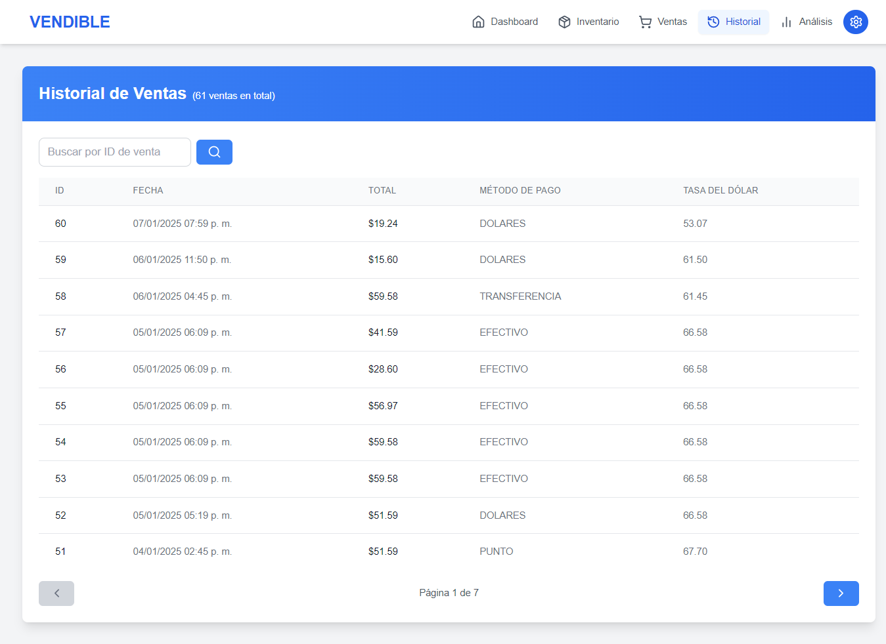
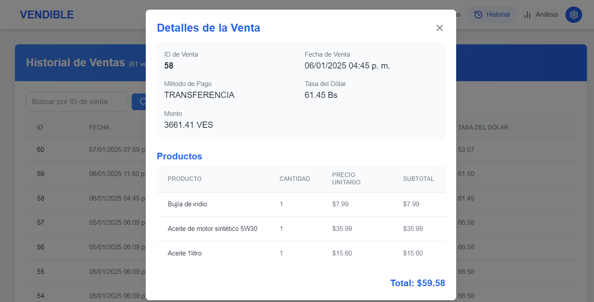
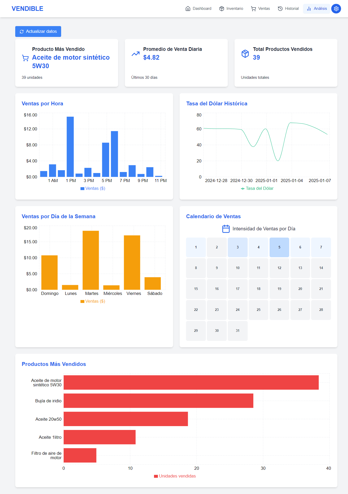
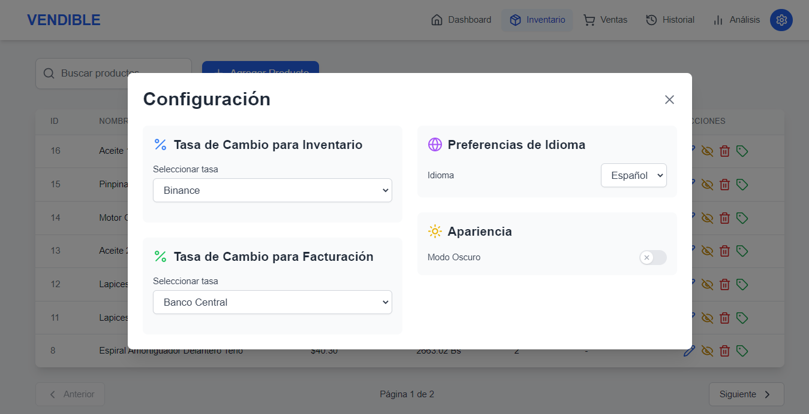

# VENDIBLE

  

Billing and Inventory System developed by DASCA

## 📋 Description

VENDIBLE is a robust desktop application for inventory management and billing, specifically designed for businesses operating with multiple currencies. It offers an intuitive interface and comprehensive functionalities for sales and inventory control.

## 🖥️ User Interface

### Dashboard

Overview with important metrics, updated exchange rates, and sales summary.

### Inventory

Complete product management with advanced search and filtering system.

### Sales

Intuitive sales system with shopping cart and multiple payment methods.

### Sales Modal

Payment registration interface with support for multiple currencies.

### History

Detailed record of all transactions made.

### Sale Details

Detailed view of each transaction with complete information.

### Analysis

Detailed sales and performance graphs and statistics.

### Settings

Configuration panel with customization options.

### Dark Mode

Adaptive interface with dark mode for enhanced visual comfort.

## ✨ Key Features

### 💼 Inventory Management

- Complete control of products with prices in multiple currencies
- Advanced search and filtering system
- Stock management with low inventory alerts
- Product categorization

### 💰 Sales System

- Quick and efficient billing
- Multiple payment methods
- Automatic change calculation
- Intuitive shopping cart

### 📊 Dashboard and Analysis

- Visualization of key metrics
- Sales graphs by period
- Analysis of best-selling products
- Sales intensity calendar

### 📜 History and Reports

- Detailed transaction log
- Complete sales history
- Customizable reports
- Payment method tracking

## 🛠️ Technologies Used

- **Electron** - Desktop application framework
- **React** - User interface library
- **TypeScript** - Typed JavaScript superset
- **SQLite** - Local database
- **Tailwind CSS** - Styling framework
- **Recharts** - Charting library
- **Electron Builder** - Packaging and distribution

## 📦 Available Scripts

- `npm run dev` - Starts the application in development mode
- `npm run build` - Compiles the application
- `npm run build:win` - Compiles for Windows (32/64 bit)
- `npm run build:mac` - Compiles for macOS
- `npm run build:linux` - Compiles for Linux

## 🔧 Configuration

The application allows configuration of:

- Exchange rate sources (Binance, Central Bank)
- Interface language
- Visual theme (light/dark)
- Display preferences
- Customizable payment methods

## 🤝 Contribution

Contributions are welcome. Please read the contribution guidelines before submitting a pull request.

## 👥 Authors

- **Carlos Mafifa** - Lead Developer - [GitHub](https://github.com/Mafifa)

## 📞 Support

For support and inquiries, please create an issue in the repository or contact through [mafifa.github.io](https://mafifa.github.io).

---

Developed with ❤️ by DASCA